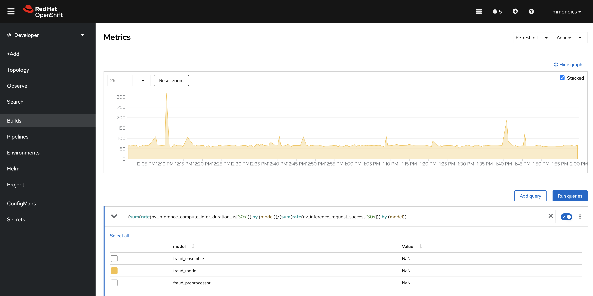
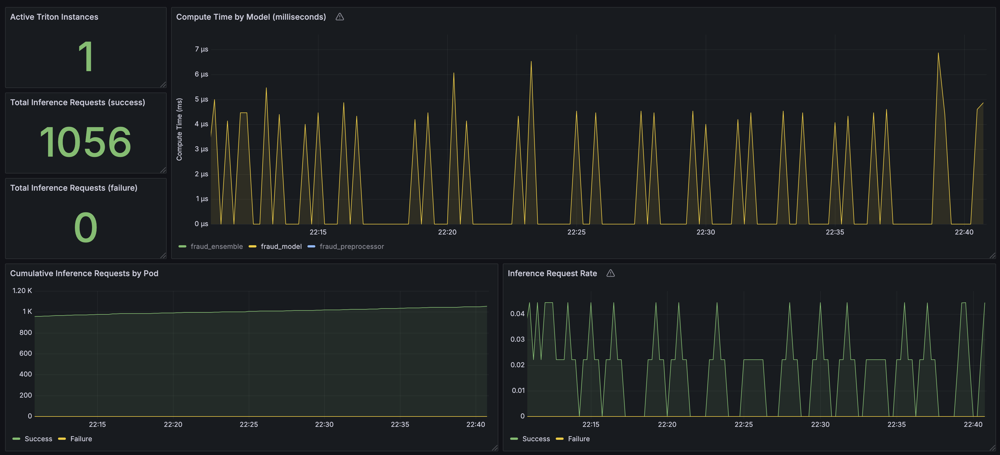

# Fraud detection with IBM LinuxONE AI Accelerator

## Deploying the model to Nvidia Triton Inferencing server

Create a pullsecret to pull the Nvidia Triton image from icr. Use the same API key from IBM Cloud as above 
```
oc create secret docker-registry icr-pullsecret \
    --docker-server=icr.io \
    --docker-username=iamapikey \
    --docker-password=<your_API_Key> \
    -n easytrade
```

Create PVC to store models. Edit the storageClassName if you want to use a specific one, otherwise the default is used.

```
oc apply -f triton-models-pvc.yaml
```

Create a helper pod to upload model to pvc

```
oc apply -f model-uploader.yaml
oc cp fraud_model model-uploader:/models/ -n easytrade
```

Deploy the Triton Inference Server

```
oc apply -f triton.yaml
```

Expose the Triton service 

```
oc expose svc svc-triton-accelerated
```

Your model can now be hit with inference requests at `http://<route_hostname>/v2/models/fraud_ensemble/infer`

You can print your Triton Inference Server endpoint with

```
TRITON_ENDPOINT="http://$(oc get route svc-triton-accelerated -n easytrade -o=jsonpath='{.spec.host}')"
echo $TRITON_ENDPOINT
```

Check that the model is ready. 200 status indicates it's ready.

```
curl -kv $TRITON_ENDPOINT/v2/models/fraud_model/ready
```

## Activate fraud detection for the easytrade broker-service
By default, fraud detection is deactivated for the [easytrade broker-service](/src/broker-service/). With the Triton Inference Server deployed and showing ready with a 200 status call, you can activate fraud detection for each request to buy or sell an instrument.

For the broker-service deployment, set the `ENABLE_FRAUD_DETECTION` environment variable to `true`.
Also set the `TRITON_FRAUD_URL` environment variable to `http://<your_triton_hostname>/v2/models/fraud_ensemble/infer`

```
# Set the TRITON_FRAUD_URL environment variable
oc -n easytrade set env deployment broker-service ENABLE_FRAUD_DETECTION=true

# Set the TRITON_FRAUD_URL environment variable
export TRITON_ENDPOINT="http://$(oc get route svc-triton-accelerated -n easytrade -o=jsonpath='{.spec.host}')/v2/models/fraud_ensemble/infer"
oc -n easytrade set env deployment broker-service TRITON_FRAUD_URL=$TRITON_ENDPOINT
```

Navigate to easytrade in a web browser, log in as a user, and buy an instrument.

Check the `broker-service` pod logs to see the fraud score.

```
[16/04/25 03:44:48 | Information] 🧠 Fraud score for BuyAssets: 0.7734375 | Entities.Trades.Service.TradeService
```

## Run some test inferences against the model

Run the `test_trades_with_triton.py` script to test a variety of trades to see the varying levels of suspected fraud detected.

```
export TRITON_ENDPOINT="http://$(oc get route svc-triton-accelerated -n easytrade -o=jsonpath='{.spec.host}')/v2/models/fraud_ensemble/infer"
python training/test_trades_with_triton.py
```

Sample output:

```
Test 1: Normal buy, small value
  Input: [4.0, 1.0, 0.0, 10.0, 25.0, 250.0, 14.0, 2.0, 1.0]
  Fraud Score: 0.16943359375

Test 2: Large value trade
  Input: [6.0, 2.0, 1.0, 150.0, 100.0, 15000.0, 10.0, 1.0, 1.0]
  Fraud Score: 0.7109375

Test 3: Failed trade at night
  Input: [8.0, 3.0, 0.0, 25.0, 300.0, 7500.0, 2.0, 5.0, 0.0]
  Fraud Score: 0.650390625

Test 4: Successful trade at night
  Input: [5.0, 4.0, 1.0, 50.0, 50.0, 2500.0, 23.0, 4.0, 1.0]
  Fraud Score: 0.25830078125

Test 5: Trade with high quantity but low value
  Input: [7.0, 5.0, 0.0, 10000.0, 0.2, 2000.0, 12.0, 0.0, 1.0]
  Fraud Score: 1.0

Test 6: High value failed trade
  Input: [6.0, 2.0, 0.0, 100.0, 200.0, 20000.0, 13.0, 3.0, 0.0]
  Fraud Score: 0.931640625
```

## Configuring Triton Inference Server Metrics

The Triton Inference Server provides Prometheus metrics for inference counts, inference latency, cpu/memory consumption, and more.

More info [here](https://github.com/triton-inference-server/server/blob/r24.07/docs/user_guide/metrics.md).

Expose the /metrics endpoint at port 8002
```
oc expose svc svc-triton-accelerated --name=triton-metrics --port=8002
```

Access the metrics endpoint either via API call or in a web browser

```
TRITON_METRICS_ENDPOINT="http://$(oc get route triton-metrics -n easytrade -o=jsonpath='{.spec.host}')"/metrics
echo $TRITON_METRICS_ENDPOINT

curl -k $TRITON_METRICS_ENDPOINT
```

## Integrating Triton Inference Server Prometheus Instance with OpenShift Monitoring
The Triton Prometheus instance can be integrated into the default OpenShift monitoring stack.

Make sure user workload monitoring is [enabled](https://docs.redhat.com/en/documentation/openshift_container_platform/4.18/html/monitoring/configuring-user-workload-monitoring#enabling-monitoring-for-user-defined-projects-uwm_preparing-to-configure-the-monitoring-stack-uwm)

Create a serviceMonitor for the Triton Inference Server's Prometheus
```
oc -n easytrade apply -f servicemonitor.yaml
```

You should now be able to see the Triton metrics in the OpenShift metrics (Prometheus) page. For example, the following query will display the Inference Time by Model in microseconds: 

`(sum(rate(nv_inference_compute_infer_duration_us[30s])) by (model))/(sum(rate(nv_inference_request_success[30s])) by (model))`



You can now forward the Triton metrics to an external Grafana instance.



## Training the fraud detection model with pytorch and convert to onnx
This section is for reference. The fraud detection model is already trained, converted to onnx, and provided in this repository.

```
# Create a conda environment
conda create -n fraud-detection python=3.10 -y
conda activate fraud-detection

# Install required libraries
conda install -n fraud-detection pandas scikit-learn pytorch onnx matplotlib seaborn requests imbalanced-learn -c pytorch -c conda-forge

# Train the model
python train_fraud_model.py
```

## Convert the .onnx model to onnx-mlir (.so)
This section is for reference. The onnx-mlir (.so) model is provided in this repository.

This section includes a step that utilizes an s390x architecture container image which should be run on an s390x Linux host.

```
# If not on an IBM LinuxONE or IBM Z linux host, scp the .onnx model to one
scp model.onnx <user>@<LinuxONE_host>:~/fraud-detection

# On the s390x host, log in to the IBM Cloud container registry following the instructions here: https://ibm.github.io/ibm-z-oss-hub/main/main.html

# Convert the model
# More information here: https://github.com/IBM/zDLC?tab=readme-ov-file#build-so
podman run --rm --privileged \
    -v ~/fraud-detection:/workdir:z \
    icr.io/ibmz/zdlc:4.2.0 \
    --EmitLib --O3 --mcpu=z16 \
    --mtriple=s390x-ibm-loz \
    --maccel=NNPA \
    model.onnx
```

model.so should now be located alongside the .onnx model in the `~/fraud-detection` directory.